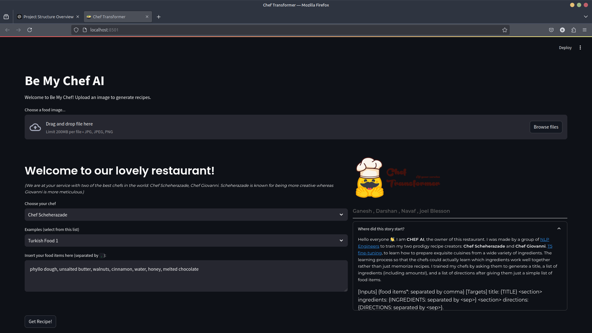

# **Be My Chef AI - Recipe Generation from Food Images**

 <!-- Replace with the actual path to your logo image -->

Are you curious about recreating delicious dishes from just a picture? **Be My Chef AI** is here to help! This project leverages advanced AI models to generate detailed recipes based on food images. By analyzing a picture of a dish, the system predicts the ingredients and provides step-by-step cooking instructions to recreate it.

<!--## **Demo**

[](http://localhost:8501) <!-- Replace with a link to your demo video or live app -->

## Project Link

Check out the live version of the project [here](https://be-my-chef-ai.streamlit.app/).

Upload an image, and watch as the AI generates a complete recipe for you!

## **Features**

- **Image-Based Ingredient Prediction**: Upload a food image, and the AI predicts the ingredients present.
- **Recipe Generation**: Generates a detailed recipe with a title, ingredients list, and cooking instructions.
- **Multiple Chef Models**: Choose between different chef personas for varied recipe styles.
- **User-Friendly Interface**: Easy-to-use interface built with Streamlit.

## **Model Details**

The application uses a combination of Convolutional Neural Networks (CNNs) and Transformer models:

- **CNN Encoder**: Processes the input food image to extract visual features.
- **Ingredient Decoder**: Predicts the ingredients present in the dish.
- **Transformer Decoder**: Generates the cooking instructions based on the predicted ingredients and image features.

## **Setup Instructions**

### **1. Prerequisites**

#### a. **Install Conda (if not installed)**

Download and install Miniconda from the [official website](https://docs.conda.io/en/latest/miniconda.html) suitable for your operating system.

#### b. **Download Model Files**

You need to download three essential files for the model to function:

1. **Model Weights**: [Download `modelbest.ckpt`](https://dl.fbaipublicfiles.com/inversecooking/modelbest.ckpt)
2. **Ingredients Vocabulary**: [Download `ingr_vocab.pkl`](https://dl.fbaipublicfiles.com/inversecooking/ingr_vocab.pkl)
3. **Instruction Vocabulary**: [Download `instr_vocab.pkl`](https://dl.fbaipublicfiles.com/inversecooking/instr_vocab.pkl)

Place these files in the `Foodimg2Ing/data/` directory within your project folder.

### **2. Installation**

#### a. **Clone the Repository**

```bash
git clone https://github.com/GaneshAdimalupu/Recipe-Generation-from-Food-Image.git
cd Recipe-Generation-from-Food-Image
```

#### b. **Create and Activate Conda Environment**

```bash
conda create -n chef python=3.10.16
conda activate chef
```

#### c. **Install Dependencies**

```bash
pip install -r requirements.txt
```

### **3. Running the Application**

Start the Streamlit app by running:

```bash
streamlit run app.py
```

After running this command, you will see output similar to:

```
You can now view your Streamlit app in your browser.

  Local URL: http://localhost:8501
  Network URL: http://192.168.X.XXX:8501
```

Open the Local URL in your web browser to interact with the app.

### **Using the App**

1. **Upload a Food Image**: Click on "Choose a food image" and select an image (jpg, jpeg, or png).
2. **View Uploaded Image**: The app will display the image you've uploaded.
3. **Ingredient Prediction**: The app processes the image and predicts the ingredients.
4. **Select Chef Model**: Choose between "Chef Scheherazade" or "Chef Giovanni" for different recipe styles.
5. **Generate Recipe**: Click on "Get Recipe!" to generate the recipe.
6. **View Recipe**: The app will display the recipe title, ingredients list, and cooking instructions.

## **Screenshots**

<!-- Replace with actual screenshot path -->

## Evaluation

...

### Result

Since the test set is not available, we will evaluate the model based on a shared test set. This test set consists of 5% of the whole test (_= 5,000 records_),
and we will generate five recipes for each input(_= 25,000 records_).
The following table summarizes the scores obtained by the **Chef Transformer** and **RecipeNLG** as our baseline.

|                                       Model                                       |   COSIM    |    WER     |  ROUGE-2   |    BLEU    |    GLEU    |   METEOR   |
| :-------------------------------------------------------------------------------: | :--------: | :--------: | :--------: | :--------: | :--------: | :--------: |
|                [RecipeNLG](https://huggingface.co/mbien/recipenlg)                |   0.5723   |   1.2125   |   0.1354   |   0.1164   |   0.1503   |   0.2309   |
| [Chef Transformer](https://huggingface.co/flax-community/t5-recipe-generation) \* | **0.7282** | **0.7613** | **0.2470** | **0.3245** | **0.2624** | **0.4150** |

_From the 5 generated recipes corresponding to each NER (food items), only the highest score was taken into account in the WER, COSIM, and ROUGE metrics. At the same time, BLEU, GLEU, Meteor were designed to have many possible references._

## Streamlit demo

```bash
streamlit run app.py
```

## Looking to contribute?

Then follow the steps mentioned in this [contributing guide](CONTRIBUTING.md) and you are good to go.

## Copyright

Special thanks to those who provided these fantastic materials.

- [Anatomy](https://www.flaticon.com/free-icon)
- [Chef Hat](https://www.vecteezy.com/members/jellyfishwater)
- [Moira Nazzari](https://pixabay.com/photos/food-dessert-cake-eggs-butter-3048440/)
- [Instagram Post](https://www.freepik.com/free-psd/recipes-ad-social-media-post-template_11520617.htm)

## **Dependencies**

Ensure all dependencies are installed by running:

```bash
pip install -r requirements.txt
```

Key dependencies include:

- Streamlit: For building the web interface.
- PyTorch: Deep learning framework for model implementation.
- Transformers: For utilizing Transformer models.
- Pillow: Image processing.
- Torchvision: For image transformations and pre-trained models.

## **Performance Tips**

- **Use GPU**: If your system supports GPU acceleration, PyTorch will automatically leverage it for faster model inference.
- **Run on Cloud**: You can deploy this app on platforms like Heroku, AWS, or Google Cloud for production-level scaling.
- **Batch Processing**: For processing multiple images at once, consider batching inputs to optimize performance.

## **Troubleshooting**

### **Common Errors and Solutions**

- **ModuleNotFoundError**: If you encounter errors about missing modules, ensure that all dependencies are installed and that your Python environment is correctly set up.
- **FileNotFoundError for Model Files**: Verify that `modelbest.ckpt`, `ingr_vocab.pkl`, and `instr_vocab.pkl` are placed in the correct directory (`Foodimg2Ing/data/`).
- **AttributeError in Streamlit**: If you receive errors like `'NoneType' object has no attribute 'format'`, ensure that the image generation function returns a valid image URL or handle cases where the image may be `None`.
- **CUDA Errors**: If you encounter CUDA-related warnings and you don't have a GPU or prefer to run on CPU, you can disable CUDA by setting the environment variable before running the app:

```bash
export CUDA_VISIBLE_DEVICES=-1
```

- **Port Already in Use**: If Streamlit indicates that the default port 8501 is in use, specify a different port:

```bash
streamlit run app.py --server.port 8502
```

## **Future Enhancements**

- **Real-time Recipe Adjustments**: Dynamically adjust recipes based on user preferences or dietary restrictions.
- **Cultural Integration**: Tailor recipes based on regional or cultural preferences.
- **Voice Commands**: Allow users to upload images and get recipes via voice commands.
- **Mobile App**: Convert the web app to a mobile app for easier accessibility.

## **Deploying to Heroku**

You can easily deploy this app to Heroku by following these steps:

1. **Install the Heroku CLI**: https://devcenter.heroku.com/articles/heroku-cli
2. **Login to Heroku**:

```bash
heroku login
```

3. **Create a new Heroku app**:

```bash
heroku create your-app-name
```

4. **Push the code**:

```bash
git push heroku main
```

For full deployment instructions, visit Heroku's Documentation.

## **Credits**

This project is built upon the efforts of the following repositories:

- Recipe Generation from Food Image by navassherif98
- [Recipe Generation from Food Image by navassherif98](https://github.com/navassherif98)
- Chef Transformer by chef-transformer
- [Chef Transformer by chef-transformer](https://github.com/chef-transformer)

## **License**

This project is licensed under the MIT License. See the LICENSE file for details.

## **Acknowledgments**

- The model is inspired by the work from Inverse Cooking: Recipe Generation from Food Images.
- Thanks to the developers of Streamlit for providing an easy way to build web apps.

## **Contact**

For any inquiries or support, please contact:

- Ganesh Adimalupu
- Email: Ganeshjohn253@gmail.com
- GitHub: GaneshAdimalupu
